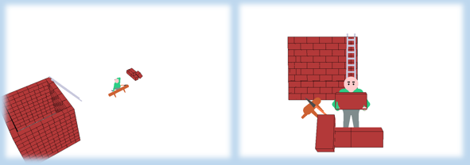
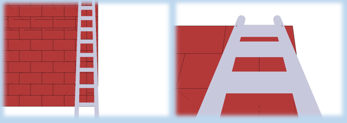
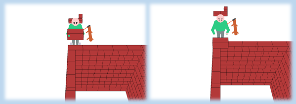
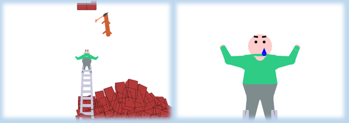
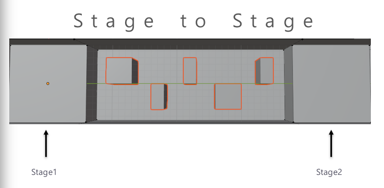
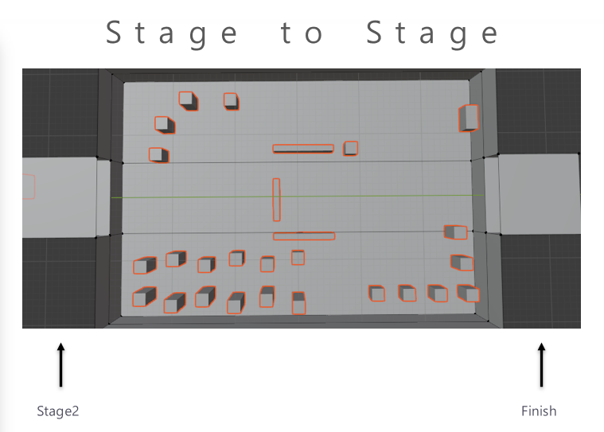

# Animation Project

### MP4

./Animation_Project/Animation.mp4

### 30 seconds Animation

term : Week_4 ~ Week_8

### Point of View

1. time callback with Count variable
2. drawCylinder function
3. angles of body
4. collapes of house

## Story

### Starting work with his heavy body

The appearance coming with taking a break.

View of the workplace are produced by moving the camera.

The viewpoint follows the movement.

### Moving a heavy brick (View Change)

Directed by changing to the his-view to give the feeling of carrying heavy bricks

### Earthquake !

Earthquake seen with moving Camera.

### Ending with Tear

# Game Project

### MP4

./Game_Project/Game_Play.mov

### Jump Map with OpenGL

term : Week_9 ~ Week_12

### Point of View

1. DeltaTime (produce same control in different FPS) - glutGet(GLUT_ELAPSE_TIME)
2. Keyboard callback (can press more than 2 keys)
3. Jump
4. import Objects (Objects are made by Blender)
5. import textures

## How To Play?

'w', 'a', 's', 'd' is the player's movement.

'space' is player's jump

### Stage to Stage

