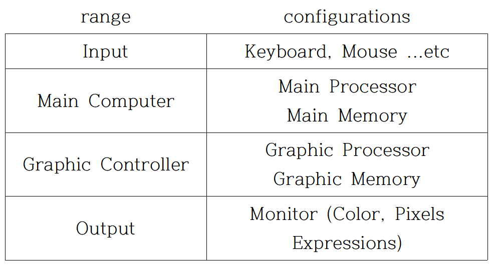

# Starting Computer Graphics...

## What is Computer Graphics?

Technology of making pictures using a computer

It refers to a method of digitally representing figures that can be seen by humans through data.

## Hardware for Computer Graphics

## Tools for Computer Graphics

* Low-Level : OpenGL, DirectX
* High-Level : Unity3D, Unreal Engine
* Processing
* 3D Max
... etc

## What is Open GL?

OpenGL (Open Graphics Library) is a cross-language, cross-platform application programming interface (API) for rendering 2D and 3D vector graphics.

The API is typically used to interact with a graphics processing unit (GPU), to achieve hardware-accelerated rendering.

## Vector & Raster

Vector graphics : a set of pixel areas using several line segments

Elements are stored as commands and the picture is displayed by the movement of the scanning line due to the command.

Raster graphics : raster means 'pixels'.

Pixels are the basic elements of a picture, expressed in units of a square shape.

The difference between the two methods is the existence (raster)/nothing (vector) of aliasing (the effect of preventing different signals from being distinguished).

## My first Picture in OpenGL

Code : Week_1_code1.c++

