# Glut Modeling (Methods that are made)

## Cube

### glutSolidCube(GLdouble size)

### glutWireCube(GLdouble size)

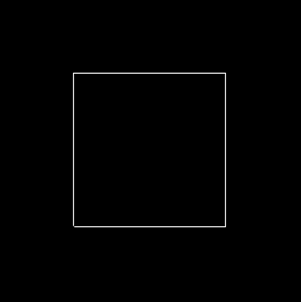

## Sphere

### glutSolidSphere(GLdouble radius, GLint slices, GLint stacks)

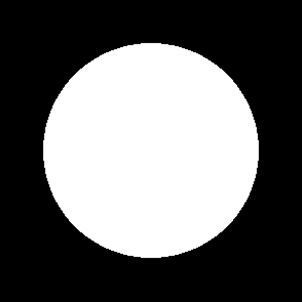

### glutWireSphere(GLdouble radius, GLint slices, GLint stacks)

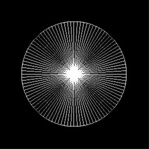

## Torus

### glutSolidTorus(GLdoube innerRadius, GLdoube outerRadius, GLint nsides, GLint rings)

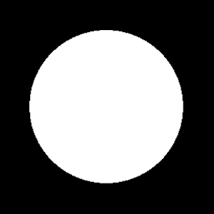

### glutWireTorus(GLdoube innerRadius, GLdoube outerRadius, GLint nsides, GLint rings)

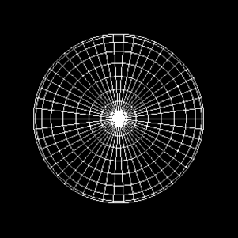

## Cone

### glutSolidCone(GLdouble base, GLdouble height, GLint slices, GLint stacks)

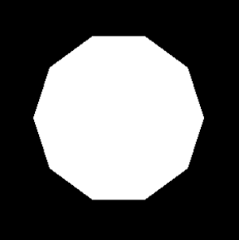

### glutWireCone(GLdouble base, GLdouble height, GLint slices, GLint stacks)

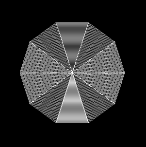

## Tetrahedron

### glutSolidTetrahedron(void)

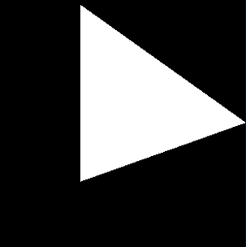

### glutWireTetrahedron(void)

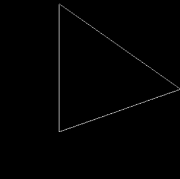

## Icosahedron

### glutSolidIcosahedron(void)

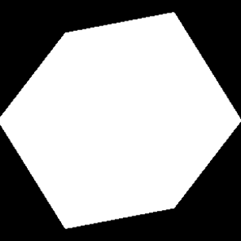

### glutWireIcosahedron(void)

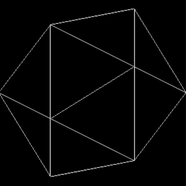

## Teapot

### glutSolidTeapot(GLdouble size)

### glutWireTeapot(GLdouble size)

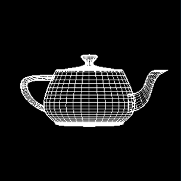

# What I Made

Code : Week_2_code1.c++

Using : Reshape callback / Keyboard callback

1. press 'a' with changing mode
2. exit key ('q', 'Q', esc)

## mode 0

## mode 1

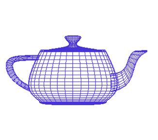

## mode 2

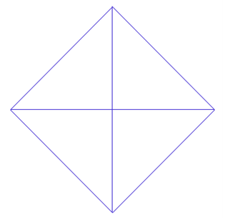

## mode 3

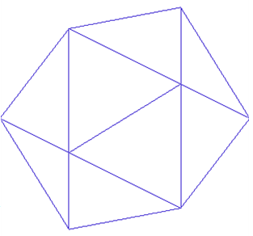

## mode 4

